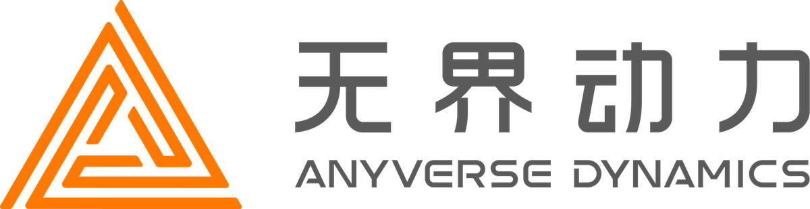

<p align="left">
  
</p>

# Does Online Gravity Estimation Matter?

**Revisiting a Silent Design Split in LiDAR-Inertial Odometry**

Jie Xu · Ziyi Jin · Kangjin Yu · Can Jiang · Hongjun Huang · Tongxing Jin · Hongkun Luo · Zhongpu Xia

Anyverse Dynamics | 无界动力

[Paper (preprint PDF)](paper/preprint.pdf) · [Video](#video) · [Reproduction archive](https://github.com/jiejie567/rethink-lio-gravity/releases/tag/v1.0.0)

Corresponding author: Zhongpu Xia. Contact: Jie Xu
([jeff_xu_0503@foxmail.com](mailto:jeff_xu_0503@foxmail.com)).

An LIO system can change its estimate of “down” while barely changing its
trajectory. Is online gravity doing useful work, or just adding a state?
We test this inside FAST-LIO2 and LIO-SAM by changing whether gravity and
accelerometer bias remain online.

**Keep both gravity and accelerometer bias online by default. The tested
same-IMU direction factor is not a generic z-drift remedy.**

## Video

https://github.com/user-attachments/assets/c3f4aaa6-e61e-4339-bcfb-015d5a785b81

Watch the point clouds, the missing scans, and the recovery that follows.
The footage is real RViz output; the plots show the paper's audited experiment results.

## What we found

- **With regular scans, fixing gravity changes little.** Across the FAST-LIO2
  sequences, average vertical and 3D position errors remain close to the online
  baseline. LIO-SAM likewise shows no consistent accuracy gain from online gravity.
- **A few seconds without scans changes the picture.** Runs with identical
  histories before an outage separate during recovery. Starting in motion also
  exposes failures in fixed-bias configurations, which helps explain why we
  still recommend keeping both states online.
- **A direction factor is not a height sensor.** Under repeated LiDAR outages,
  the tested factor improves both errors on Hall05 but worsens both on TUHH with
  online gravity. Better direction agreement alone is not enough to justify it.

These are controlled changes within each estimator, not a FAST-LIO2 versus
LIO-SAM leaderboard. We remove states from the estimator and test the added
direction factor separately. That factor reuses the IMU already used for
preintegration; independent gravity sensors and global pose-graph priors are
outside this study.

The practical reason to keep gravity and bias online is room to recover, not
a promise that either estimate is physically exact.

## Check the results yourself

You can check the paper's results without replaying a single bag. The code and
result summaries are here; trajectories, state logs, ground truth, failure
records and checksums are in
[`lio-gravity-evidence.zip`](https://github.com/jiejie567/rethink-lio-gravity/releases/tag/v1.0.0).

Download and extract that archive, then run from its root:

```sh
python3 -m venv .venv
.venv/bin/python -m pip install -r requirements.txt
.venv/bin/python verify_review.py
.venv/bin/python verify_review.py --recompute --figures
```

This checks file integrity, recomputes trajectory errors, and rebuilds the
tables and figures. You do not need ROS, Docker, a GPU or the original bags.

To follow a finding back to its runs, start with [EVIDENCE_MAP.md](EVIDENCE_MAP.md).
[PROTOCOL.md](PROTOCOL.md) explains alignment and which comparisons belong together;
[RUNNING.md](RUNNING.md) covers rerunning the estimators on the original bags.

The archive also retains failures, excluded runs and binary fingerprints. Use
the comparisons defined in the reports, and run new experiments serially with
the provided run lock.

## Contents

| Location | Contents |
|---|---|
| `scripts/`, `configs/`, `docker/` | Experiment runners, validation and analysis |
| `catkin_ws/src/FAST_LIO/` | FAST-LIO2 state-removal variants |
| `liosam_ws/src/LIO-SAM/` | LIO-SAM state and direction-factor ablations |
| `report/` | Source reports and figure data |
| `paper/` | Paper, TeX sources and figures |
| `media/` | Video and preview |

Raw bags and historical binaries are not included. Dataset links and usage
terms are listed in [DATA_SOURCES.md](DATA_SOURCES.md).

## Citation and licence

Citation details are in [CITATION.cff](CITATION.cff).

Our experiment and analysis scripts use the MIT license. Third-party software,
datasets, the paper and video have separate terms; see
[LICENSE_SCOPE.md](LICENSE_SCOPE.md) and the in-tree notices.
