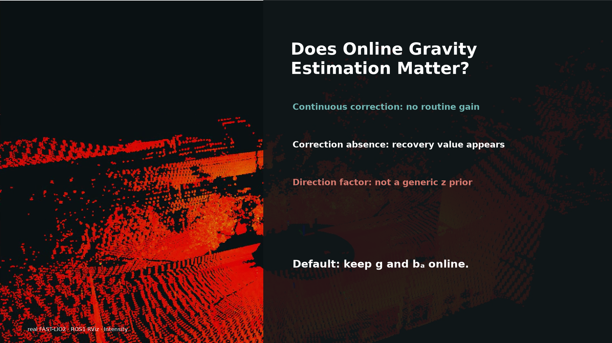

# Does Online Gravity Estimation Matter?

**Revisiting a Silent Design Split in LiDAR-Inertial Odometry**

Xu Jie · Jin Ziyi · Yu Kangjin · Huang Hongjun · Jin Tongxing · Luo Hongkun · Xia Zhongpu

Anyverse Dynamics

[Paper (preprint PDF)](paper/preprint.pdf) · [Video](media/demo.mp4) · [Reproduction archive](https://github.com/jiejie567/lio-gravity-ablation/releases/tag/v1.0.0)

The updated seven-author preprint and its source are in
[v1.0.1](https://github.com/jiejie567/lio-gravity-ablation/releases/tag/v1.0.1).

We test gravity and accelerometer-bias state choices within FAST-LIO2 and
LIO-SAM, keeping the rest of each estimator fixed. We separately test a
gravity-direction factor derived from the same IMU used for preintegration.

**Keep both gravity and accelerometer bias online by default. The tested
same-IMU direction factor is not a generic z-drift remedy.**

Continuous LiDAR correction largely masks the value of online gravity.
Multi-second correction gaps and motion during startup expose costs of removing
state freedom. A direction factor can help on one trajectory and hurt on another;
direction agreement alone is not evidence of better height estimation.

## Video

[](https://github.com/jiejie567/lio-gravity-ablation/raw/refs/heads/main/media/demo.mp4)

[Open or download the MP4](media/demo.mp4). The video uses real RViz recordings;
quantitative overlays come from audited experiments. Dataset attribution and
reuse conditions are in [DATA_SOURCES.md](DATA_SOURCES.md).

## Reproduce the reported results

The Git repository keeps the code, configurations, machine-readable reports,
and manuscript assets small enough to browse. Recorded trajectories, state
logs, ground truth, retained failures, and excluded-run records are distributed
in the versioned [Release](https://github.com/jiejie567/lio-gravity-ablation/releases/tag/v1.0.0)
as `lio-gravity-evidence.zip`, with SHA-256 checksums.

Download and extract that archive, then run from its root:

```sh
python3 -m venv .venv
.venv/bin/python -m pip install -r requirements.txt
.venv/bin/python verify_review.py
.venv/bin/python verify_review.py --recompute --figures
```

These checks do not require ROS, Docker, a GPU, or raw bags. They verify the
manifest, recompute supported trajectory metrics, and regenerate tables and
figures. See [PROTOCOL.md](PROTOCOL.md) for alignment and inference units,
[EVIDENCE_MAP.md](EVIDENCE_MAP.md) for claim-to-file mappings, and
[RUNNING.md](RUNNING.md) for estimator reruns. Run estimator experiments serially;
do not bypass the run lock.

The current source is inspectable but does not prove the provenance of every
historical executable. Original binary fingerprints and failure outcomes are
retained in the evidence archive. Do not pool every historical run as an
independent sample; the report files define the admitted comparisons.

## Contents

| Location | Contents |
|---|---|
| `scripts/`, `configs/`, `docker/` | Experiment runners, validation and analysis |
| `catkin_ws/src/FAST_LIO/` | FAST-LIO2 state-removal variants |
| `liosam_ws/src/LIO-SAM/` | LIO-SAM state and direction-factor ablations |
| `report/` | Source reports and figure data |
| `paper/` | Named preprint, TeX sources and vector figures |
| `media/` | Video and preview |

Raw LiDAR/IMU bags and historical binaries are not redistributed. Obtain the
datasets from their original providers. Independent gravity sensors and
downstream global loop-closure PGO priors were not tested.

## Citation and licence

Use [CITATION.cff](CITATION.cff). This is a preprint release, not an acceptance
announcement. No arXiv identifier has been assigned by this release workflow.

Original experiment/analysis scripts are MIT licensed. Third-party software,
data, manuscript, and video are **not** covered by that blanket grant; see
[LICENSE_SCOPE.md](LICENSE_SCOPE.md) and the in-tree notices.
